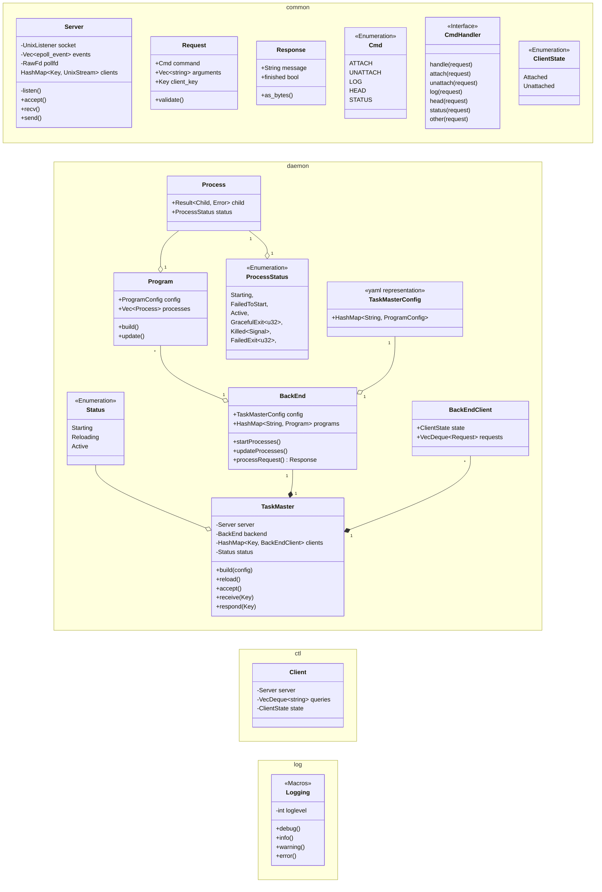

```mermaid
classDiagram
direction LR
namespace common {
    class Server {
        -UnixListener socket
        -Vec~epoll_event~ events
        -RawFd pollfd
        HashMap~Key, UnixStream~ clients

        -listen()
        +accept()
        +recv()
        +send()

    }
    class Request {
        +Cmd command
        +Vec~string~ arguments
        +Key client_key
        +validate()
    }
    class Response {
        +String message
        +finished bool
        +as_bytes()
    }
    class Cmd {
        <<Enumeration>>
        ATTACH
        UNATTACH
        LOG
        HEAD
        STATUS
    }
    class CmdHandler {
        <<Interface>>
        handle(request)
        attach(request)
        unattach(request)
        log(request)
        head(request)
        status(request)
        other(request)
    }
    class ClientState {
        <<Enumeration>>
        Attached
        Unattached
    }
}

%% Request "*" --* "1" BackEndClient
%% Server "1" --o "1" TaskMaster
%% Server "1" --o "1" Client
%% CmdHandler ..|> BackEnd


namespace daemon {
    class TaskMaster {
        -Server server
        -BackEnd backend
        -HashMap~Key, BackEndClient~ clients
        -Status status

        +build(config)
        +reload()
        +accept()
        +receive(Key)
        +respond(Key)
    }

    class Status {
        <<Enumeration>>
        Starting
        Reloading
        Active
    }

    class BackEndClient {
        +ClientState state
        +VecDeque~Request~ requests
    }

    class BackEnd {
        +TaskMasterConfig config
        +HashMap~String, Program~ programs
        +startProcesses()
        +updateProcesses()
        +processRequest() Response
    }

    class Program {
        +ProgramConfig config
        +Vec~Process~ processes

        +build()
        +update()
    }

    class Process {
        +Result~Child, Error~ child
        +ProcessStatus status
    }

    class ProcessStatus {
        <<Enumeration>>
        Starting,
        FailedToStart,
        Active,
        GracefulExit~u32~,
        Killed~Signal~,
        FailedExit~u32~,
    }

    class TaskMasterConfig {
        <<yaml representation>>
        +HashMap~String, ProgramConfig~
    }
}

Status --o TaskMaster
BackEnd "1" --* "1" TaskMaster
BackEndClient "*" --* "1" TaskMaster
Program "*" --o "1" BackEnd
Process "1" --o "1" ProcessStatus
Process "*" --o "1" Program
TaskMasterConfig "1" --o "1" BackEnd


namespace ctl {
    class Client {
        -Server server
        -VecDeque~string~ queries
        -ClientState state
    }
}

namespace log {
    class Logging {
        <<Macros>>
        -int loglevel
        +debug()
        +info()
        +warning()
        +error()
    }
}

```
